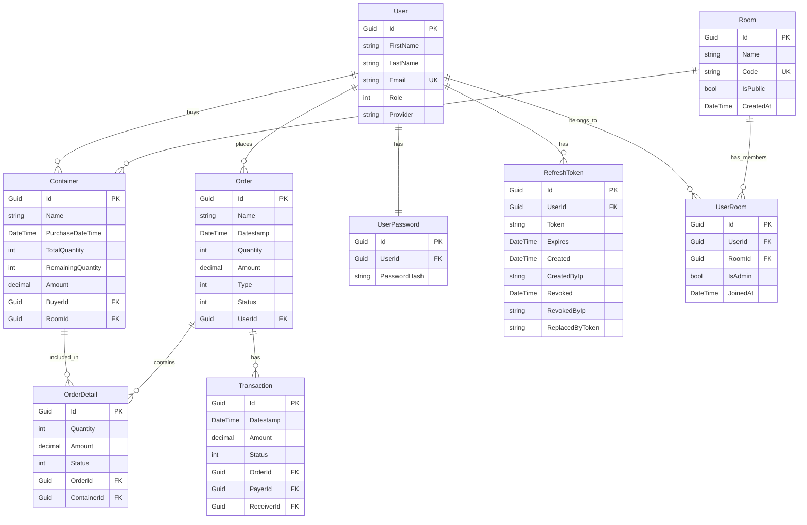

# EggLedger Database Schema Design

## Key Design Points

1. **User Management**
   - Users have secure password storage in a separate table
   - Refresh tokens handled separately for security
   - Users can be part of multiple rooms

2. **Room System**
   - Rooms have unique codes for identification
   - Public/Private room support
   - Admin privileges tracked per user per room

3. **Container Management**
   - Containers track both total and remaining quantities
   - Tied to specific rooms and buyers
   - Deletion of room cascades to containers

4. **Order System**
   - Orders can contain multiple order details
   - Order details link to specific containers
   - Orders track status and type

5. **Transaction System**
   - Transactions linked to orders
   - Separate tracking of payer and receiver
   - Status tracking for payment state

## Key Relationships

1. **User-Room Relationship**
   - Many-to-Many through UserRoom
   - Tracks admin status and join date
   - Cascade deletion for user room associations

2. **Container-Order Relationship**
   - Many-to-Many through OrderDetail
   - Tracks quantity and amount per order detail
   - Prevents container deletion when referenced by orders

3. **Transaction Flow**
   - Links payer and receiver users
   - Connected to specific orders
   - Cascading deletion with orders

## Database Constraints

1. **Unique Constraints**
   - Room codes are unique
   - User emails are unique
   - One password per user
   - One user can join a room only once

2. **Delete Behaviors**
   - Room deletion cascades to containers
   - User deletion cascades to refresh tokens
   - Order deletion cascades to details and transactions
   - Container references are protected from deletion when in use

This is a Low-Level Design (LLD) as it details:
- Exact database schema
- Field types and constraints
- Relationship cardinalities
- Delete behaviors
- Unique constraints
- Foreign key relationships
